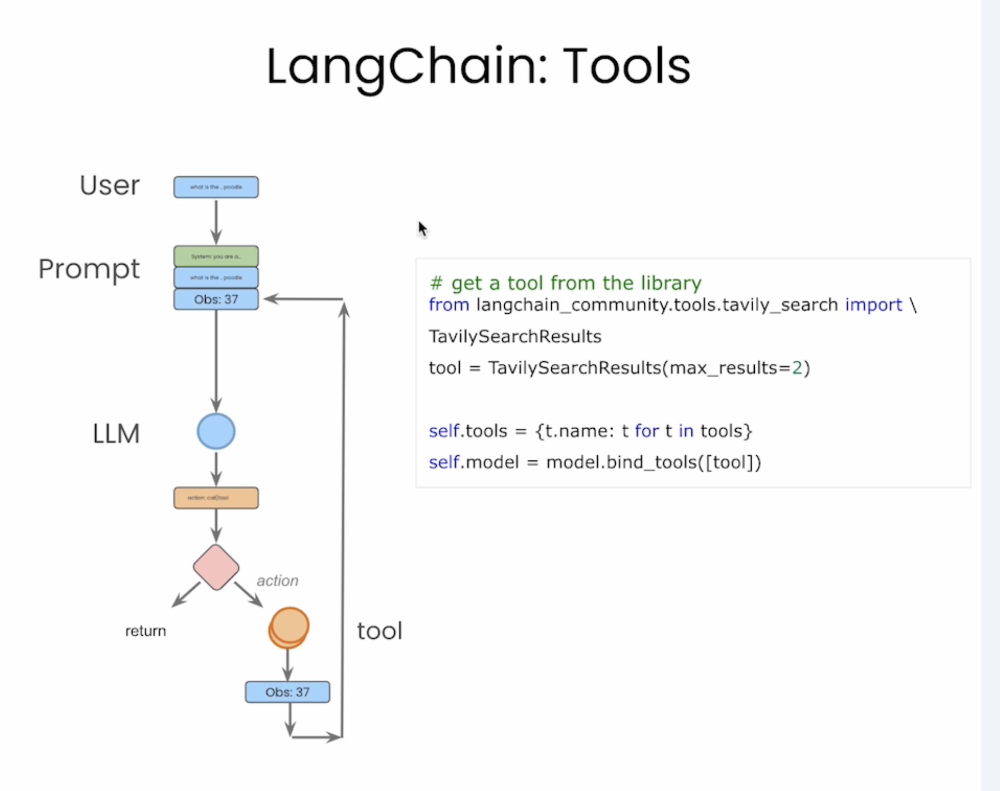

# LangChain

## Ref

### Courses

#### 0) `Deepleanring.ai` LangChain (done)

- https://learn.deeplearning.ai/courses/langchain/lesson/xf7wh/models%2C-prompts-and-parsers

#### 1) `Deepleanring.ai` LangChain (YT) (done)

- Playlist
- https://www.youtube.com/playlist?list=PLiuLMb-dLdWIYYBF3k5JI_6Od593EIuEG
	- progress
		- https://www.youtube.com/watch?v=VxAh0F08c9A&list=PLiuLMb-dLdWIYYBF3k5JI_6Od593EIuEG&index=2
		- https://www.youtube.com/watch?v=rUPSs1lVvl4&list=PLiuLMb-dLdWIYYBF3k5JI_6Od593EIuEG&index=3&pp=iAQB
		- https://www.youtube.com/watch?v=vLmK_mXuAsQ&list=PLiuLMb-dLdWIYYBF3k5JI_6Od593EIuEG&index=5
		- https://www.youtube.com/watch?v=LQlixWhNWzo&list=PLiuLMb-dLdWIYYBF3k5JI_6Od593EIuEG&index=5
		- https://youtu.be/2D8n5DNSmXI?si=T5lWzVFqZNe8WB1v
		- https://youtu.be/FKE8XtrI5wc?si=QuPgd1HqrCVd9Bg-

#### 2) Tiktok LangChain
- https://www.youtube.com/watch?v=gqKTSBGZE-g

#### 3) FreeCodeComp LangChain
- https://www.youtube.com/watch?v=jGg_1h0qzaM
	- 20240404
		- progress: 32:01
			- nb:
				- https://github.com/yennanliu/ai_experiment/blob/main/courses/LangChain/LangGraph-Course-freeCodeCamp-main/Exercises/Exercise_Graph1.ipynb
	- 20240405
		- progress: 33:13
			- nb:
				- https://github.com/yennanliu/ai_experiment/blob/main/courses/LangChain/LangGraph-Course-freeCodeCamp-main/Exercises/Exercise_Graph2.ipynb
		- progress: 44:31
			- nb:
				- https://github.com/yennanliu/ai_experiment/blob/main/courses/LangChain/LangGraph-Course-freeCodeCamp-main/Exercises/Exercise_Graph3.ipynb

