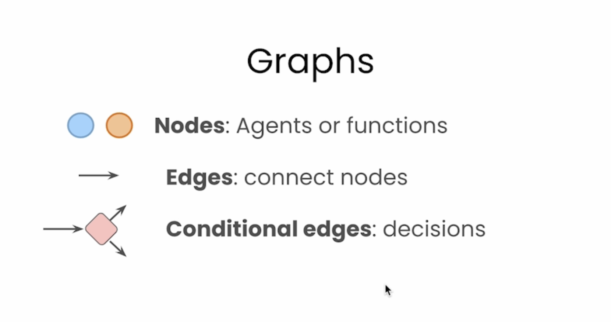
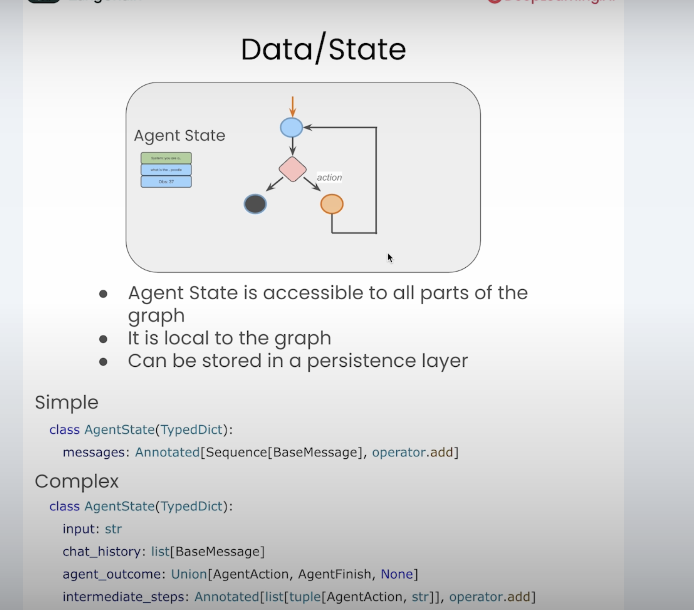
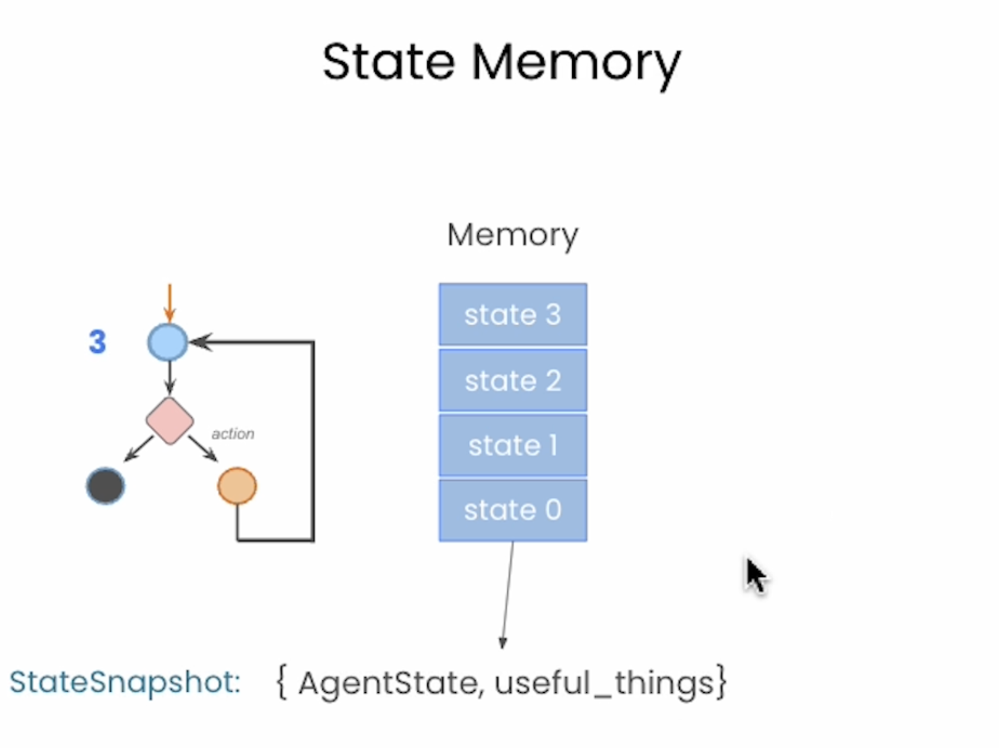
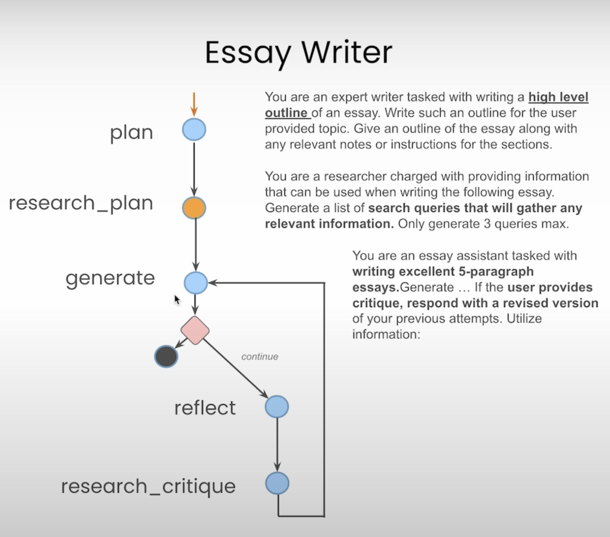
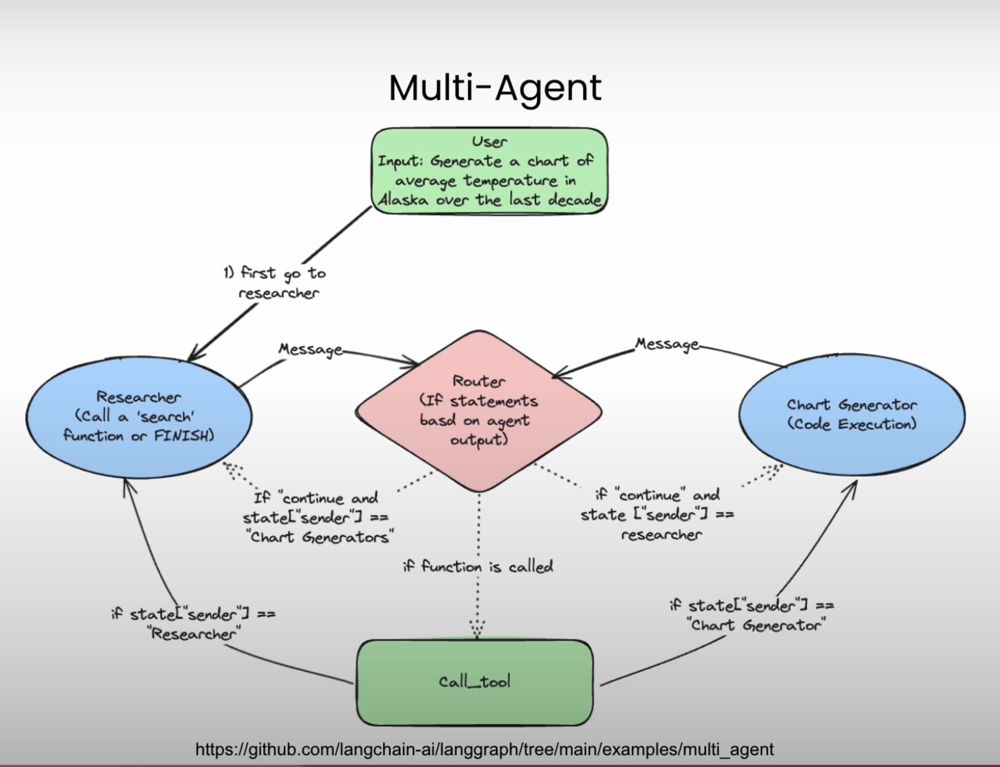
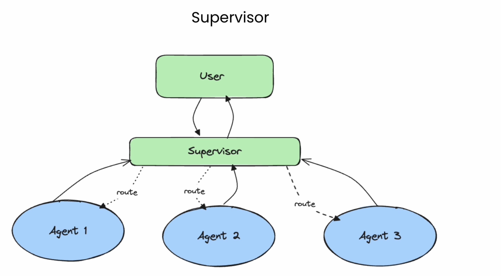
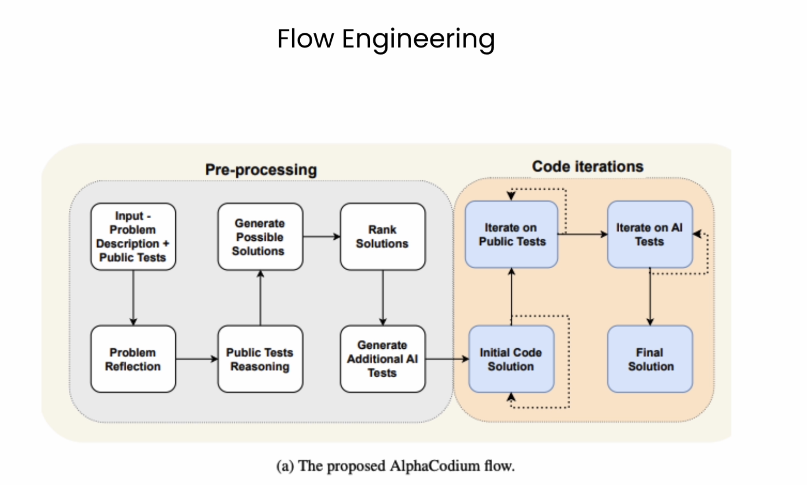

# LangGraph

---

- Other Ref

## Ref

- LangChain Hub
	- https://smith.langchain.com/hub

### Courses

#### 1) `Deepleanring.ai `  LangGraph (done)

- Playlist
	- https://learn.deeplearning.ai/courses/ai-agents-in-langgraph/information
	- progress
		- https://learn.deeplearning.ai/courses/ai-agents-in-langgraph/lesson/c1l2c/build-an-agent-from-scratch
		- https://learn.deeplearning.ai/courses/ai-agents-in-langgraph/lesson/l7rgk/langgraph-components
		- https://learn.deeplearning.ai/courses/ai-agents-in-langgraph/lesson/oj6p9/agentic-search-tools
		- https://learn.deeplearning.ai/courses/ai-agents-in-langgraph/lesson/nj9ok/persistence-and-streaming
		- https://learn.deeplearning.ai/courses/ai-agents-in-langgraph/lesson/k87e1/human-in-the-loop
		- https://learn.deeplearning.ai/courses/ai-agents-in-langgraph/lesson/m0x4m/essay-writer
		- https://learn.deeplearning.ai/courses/ai-agents-in-langgraph/lesson/kyxeg/langchain-resources
		- https://learn.deeplearning.ai/courses/ai-agents-in-langgraph/lesson/b43j5/conclusion

#### 2) FreeCodeComp `LangGraph`
- https://www.youtube.com/watch?v=jGg_1h0qzaM
	- 20240404
		- progress: 32:01
			- nb:
				- https://github.com/yennanliu/ai_experiment/blob/main/courses/LangGraph/LangGraph-Course-freeCodeCamp-main/Exercises/Exercise_Graph1.ipynb
	- 20240405
		- progress: 33:13
			- nb:
				- https://github.com/yennanliu/ai_experiment/blob/main/courses/LangGraph/LangGraph-Course-freeCodeCamp-main/Exercises/Exercise_Graph2.ipynb
		- progress: 44:31
			- nb:
				- https://github.com/yennanliu/ai_experiment/blob/main/courses/LangGraph/LangGraph-Course-freeCodeCamp-main/Exercises/Exercise_Graph3.ipynb

		- progress: 55:49
			- nb:
				- https://github.com/yennanliu/ai_experiment/blob/main/courses/LangGraph/LangGraph-Course-freeCodeCamp-main/Graphs/Conditional_Agent.ipynb

#### 3)  01.LangGraph 中文入门使用教学 - 流程化构建复杂的 AI 应用程序 之 课程介绍

- https://www.youtube.com/watch?v=QVDDxgSVo5g&list=PLliocbKHJNwvDpX6UMPpY_RBWhkxUh_Uu